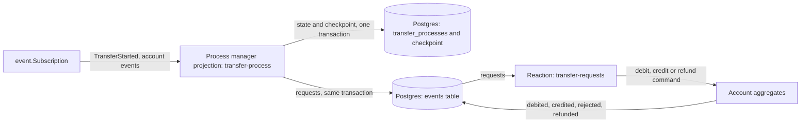
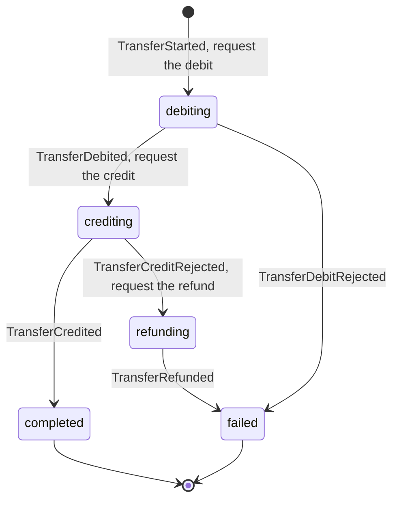

# A Money Transfer as a Process Manager

A transfer moves money from one account to another. A process manager runs it in
`internal/usecase/transfer/process`, as [event-subscription.md](event-subscription.md) describes: a projection keeps the
state of each transfer and appends its requests as events, and a reaction sends each request as a command.

The rules:

- **A failure is an event.** An account records a rejection, for example `TransferDebitRejected`, and
  does not return an error. An error would stop the reaction, but a rejection is a step that the process
  manager handles.
- **Each account decides once for each transfer.** A repeated debit, credit or refund for the same
  transfer records nothing.
- **The state guards each step.** The process manager advances only from the state that expects the
  event, so an event that arrives again asks for nothing.
- **Two writers in sequence on one stream:** the start writes `TransferStarted`. After that, only the
  process manager appends to the stream of the transfer, at the version that it keeps in its table.

This process manager runs a saga: a sequence of local transactions in which the refund undoes the debit
when the credit fails. A saga can also run with no central state, where each service reacts to the
events of the others. The two terms are often used for the same thing, but a process manager is the
central part, and a saga is the business transaction with its compensations.

## Where Each Part Lives

| Part | Package |
| --- | --- |
| The transfer example: the aggregate that starts a transfer, its events and its repository | `internal/usecase/transfer` |
| The start of a transfer, after a check that both accounts exist | `internal/usecase/transfer/start` |
| The process manager: its state, its projection, the reaction that sends its requests, and its query | `internal/usecase/transfer/process` |
| The account side of a transfer: debit, credit and refund | `internal/usecase/account/transfers` |
