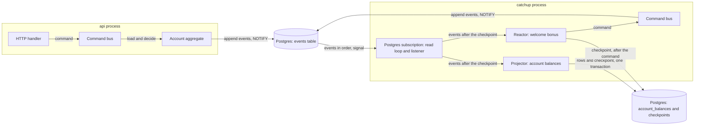
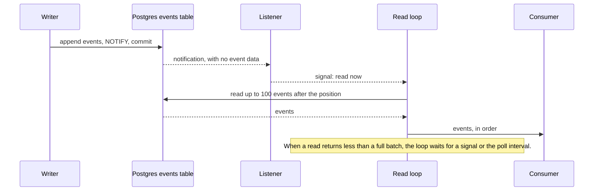
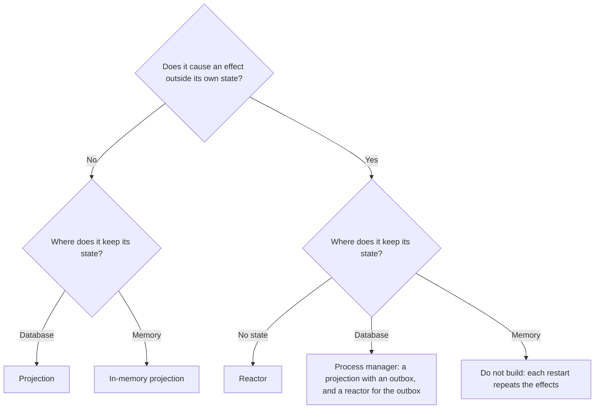

# How Events Reach Consumers From a Postgres Event Store

This application keeps its events in one Postgres table. Consumers get the events through a read loop
that wakes on a `LISTEN/NOTIFY` signal. Each consumer is one of a few kinds, and the kind follows from
two questions: does it keep state, and does it cause an effect outside that state?

## The Setup



The `api` process writes events. The `catchup` process runs the consumers. Both processes use the same
database. The welcome bonus reactor sends a command, so the `catchup` process also writes events.

## The Events Table

| Column | Use |
| --- | --- |
| `sequence` | A number from a sequence. It orders the events inside one transaction. |
| `transaction_id` | The ID of the transaction that wrote the event (`XID8`, default `pg_current_xact_id()`). |
| `stream_id`, `version` | The stream of the aggregate, and the place of the event in that stream. The pair is unique. |
| `id`, `type`, `data`, `metadata` | The event itself. |
| `schema_version` | The version of the shape of `data` for the event type. |

The position of an event in the store is the pair (`transaction_id`, `sequence`). A checkpoint saves
this pair.

The trigger `events_append_only` refuses `UPDATE`, `DELETE` and `TRUNCATE` on the table. The database,
not the code, keeps each event as it was written.

## The Write Path

`stream.NewPostgres` appends the events of one stream in one transaction. It follows these rules:

1. **Version check:** it reads the current version of the stream. If the version is not the expected
   version, it returns `event.ErrConcurrencyConflict`.
2. **Unique pair:** the unique pair (`stream_id`, `version`) stops two writers that pass the check at
   the same time. The second writer gets `event.ErrConcurrencyConflict`.
3. **Read before write:** the version check comes before the first insert. The first write takes the
   transaction ID, so a later append to the stream always gets a later transaction ID. The order of a
   stream in the store is then the same as its version order.
4. **One stream:** a transaction appends to one stream only. A write to another stream first can give
   the transaction an earlier ID than an append that it depends on.
5. **Signal:** the transaction runs `pg_notify('events', '')` before it commits. Postgres sends the
   notification only if the transaction commits.
6. **Schema version:** each insert writes the schema version that the registry has for the event type.
   The write fails for an event type that the registry does not know.

A command handler loads the aggregate from its repository, calls one method of the aggregate, and saves.
The aggregate records its new events, and the repository appends them at the version that the aggregate
was loaded at. On a concurrency conflict, the command bus calls the handler again, up to 3 times. Each
attempt loads the aggregate again, so a decision on new state is always safe to repeat. For the same
reason, a handler must not call an outside system before it saves: outside effects belong in reactions.

## The Subscription Contract

The consumers depend on four promises from `event.Subscription`:

1. Events arrive in one global order.
2. The subscription starts after a given position. When the position is nil, it starts at the
   beginning of the store.
3. The subscription never skips a committed event, also when the commit came late.
4. The subscription can send an event again. Each consumer must accept a duplicate.

## The Read Loop

`subscription.NewPostgres` has no catch-up mode and no live mode. The loop always reads from the
table. The signal only tells the loop to read now.



The loop follows these rules:

- **One data path:** only the read loop gets events, and only the read loop moves the position.
- **Signal:** the signal carries no event. A lost signal adds delay but loses no event. The poll
  interval (5 seconds) sets the maximum delay.
- **Full batch:** when a read returns a full batch, the loop reads again at once. During catch-up, the
  loop reads full batches with no wait.
- **Listener:** each subscription holds one connection for `LISTEN`. After a reconnect, the listener
  asks for one read, because events can arrive while it is down.
- **Unknown type:** the loop skips an event of a type that the registry does not know, and logs a warning.
- **Bad data:** the loop stops when an event of a known type cannot be parsed.
- **Newer schema version:** the loop stops at an event with a newer schema version than the registry
  knows. This happens when an old build reads an event from a newer build. A newer build can read the
  event, so the loop does not skip it.
- **Retry:** the loop and the listener retry each failure until the context ends. The wait doubles each
  time, up to 5 seconds.

### Why the Read Stops at the Oldest Open Transaction

A sequence number does not give commit order:

1. Transaction A takes sequence 101.
2. Transaction B takes sequence 102 and commits first.
3. The loop reads 102 and moves the position to 102.
4. Transaction A commits. Event 101 is now below the position, and the loop never reads it.

To prevent this, the loop reads only events from transactions older than the oldest open transaction:

```sql
SELECT ...
FROM events
WHERE (transaction_id, sequence) > ($1, $2)
  AND transaction_id < pg_snapshot_xmin(pg_current_snapshot())
  AND (cardinality($3::text[]) = 0 OR type = ANY($3))
ORDER BY transaction_id, sequence
LIMIT $4
```

Every transaction below that limit has ended, so no later commit can add an event below the position.
The cost is delay: one long open transaction holds back the delivery of every event after it. Keep
transactions short, also transactions that do not touch the `events` table.

`LastPosition` uses the same limit. A consumer that starts after the last position can also get a few
events from transactions that were open at that moment.

### Why a Signal Rather Than Pushed Events

A listener that pushes events makes a second data path. Two data paths need a buffer, a check for
duplicates, and logic to switch between them. The switch back to history runs only when the consumer is
slow or the connection drops. Tests seldom run that path, but production runs it under load.

Each transaction that sends `NOTIFY` takes a global lock at commit. At a high write rate, this lock
limits the commit throughput. Measure it before you depend on it.

## Kinds of Consumer

### Two Questions

1. **Does the consumer keep state?** No state, state in memory, or state in a database.
2. **Does the consumer cause an effect outside its own state?** For example, a command, an HTTP call
   or an email.

| | No outside effect | Outside effect |
| --- | --- | --- |
| **No state** | No use | Reactor |
| **State in memory** | In-memory projection, for example a cache | Do not build. Each restart replays the history and repeats the effects. |
| **State in a database** | Projection | Process manager |



### What Follows From the Kind

One fact decides the rest: does the effect commit in the same transaction as the checkpoint? If it
does, a replay is safe. If it does not, a replay repeats the effect.

| Property | Projection | In-memory projection | Reactor | Process manager |
| --- | --- | --- | --- | --- |
| Start with no checkpoint | Beginning of the store | Beginning, at each process start | End of the store, saved as the checkpoint before the first event | Beginning of the store |
| Checkpoint save | Same transaction as the rows | No checkpoint | After each effect | Same transaction as its state and its requests |
| Batch | Yes | Yes | No | Yes |
| Delivery of the effect | Exactly once, because of the transaction | Not applicable | At least once, so the effect needs an idempotency key | State and requests exactly once, commands at least once |
| Bad event | Stop. A skip makes the read model wrong. | Stop | Retry, then a dead letter and a skip, if the effects do not depend on each other | Stop |
| Rebuild | Empty the table and replay, or build a new table and swap | Restart the process | Never replay. Move the checkpoint by hand. | Not by replay: the replay appends the requests again, and the version check of the stream stops it |

A reactor also has a backlog. After downtime, it must handle each event that arrived while it was down,
from its checkpoint. It skips only the history from before it existed.

A reaction that sends the requests of a process manager is different: it starts at the beginning of the
store (`reaction.StartAtBeginning()`). Each request in the store is an effect that must happen. If the
reaction started at the end, a request that the process manager appends before the first start of the
reaction would never go out. The receivers accept a repeated command, so a first start that sends old
requests is safe.

### Two Meanings of "Mode"

1. **Delivery mode, catch-up or live:** the read loop has no such mode. No consumer needs to know about it.
2. **Replay mode, rebuild or normal:** this belongs to a consumer with state and an outside effect. When
   a process manager rebuilds its state from history, it must not send its commands again. A projection
   has no outside effect, so its replay is safe. A reactor never replays.

### A Process Manager Is a Projection and a Reactor

A process manager keeps the state of a process that spans more than one aggregate, and decides the next
step from each event. Here it is two consumers:

- **A projection** keeps the state of each process in a table. In the same transaction, it appends the
  requests that it decides as events. The events table is the outbox, so no other table is necessary.
- **A reaction** sends each request as a command. The command ID comes from the request, so a repeated
  request gives the same command, and the receiver accepts it once.

### A Command Is an Outside Effect

A reaction that sends a command has an outside effect: the aggregate appends events in its own
transaction, not in the transaction of the consumer. So the command can arrive more than once.
`dispatch.CommandIDFor` makes the command ID from the reaction name and the event ID, so a repeated
event gives the same command ID. The aggregate must also accept a repeated command. For
example, `Account.GrantWelcomeBonus` does nothing when the account already has its bonus.

### A Reaction Sends a Contract, Not an Event

An event records a fact inside this application. Its type, its fields, its stream ID and its position
belong to this application, and they change when the application changes. A reaction that tells another
service about a fact translates the event into a message that the two services agree on:

- **Small:** the message carries only what the receiver needs, and no personal data that the receiver
  does not need.
- **Versioned:** the message carries a version. The sender can add a new version, and the receiver reads
  both versions during the change.
- **Shared identity only:** the message carries an identity that both services know, for example a
  message ID. It carries no stream ID, version, transaction ID or sequence.
- **One translation:** the reaction builds the message from the event, in one place. For
  `external.NewHttpReaction`, the payload factory is that translation.

The receiver translates in the other direction. It turns the message into an ordinary command, and its
own aggregate decides what the message means there. The command records an event type of its own, named
for what happened, for example "handled in another region". It does not record the event type of a local
decision, such as "the agent dismissed the message".

With this rule, a reaction that sends local decisions out never sees an event that came in, so no change
goes back to the service that sent it. A new inbound source gets a new event type, and no reaction sends
it out until someone adds that type on purpose. The cost is that a projection which shows only the
result, for example "closed", lists each event type that closes the item.

## Where Each Part Lives

| Part | Package |
| --- | --- |
| The loop for every consumer: start position, batches, the end of the subscription | `internal/domain/consumer` |
| Projection kind: one transaction for each batch and its checkpoint | `internal/domain/projection` |
| Reaction kind: start at the end, checkpoint after each event | `internal/domain/reaction` |
| The command ID for a reaction that sends a command | `internal/domain/reaction/dispatch` |
| Reaction that sends an HTTP request with an `Idempotency-Key` header | `internal/domain/reaction/external` |
| Aggregate base: the version and the recorded events | `internal/domain` |
| Typed commands, the command bus, and its retry on a concurrency conflict | `internal/domain/command` |
| Load and save of an aggregate | `internal/domain/event/store` |
| Write path | `internal/domain/event/stream` |
| Read loop and listener | `internal/domain/event/subscription` |
| Checkpoints | `internal/domain/checkpoint/store` |
| The account example: the aggregate, its events, its commands and its repository | `internal/usecase/account` |
| One package for each account use case: its command handler, and its projection or reaction | `internal/usecase/account/open`, `deposit`, `withdraw`, `welcomebonus`, `balance` |
| The registration of every event type and every command handler | `internal/usecase/register.go` |

This application has no retry or dead letter in the reactor. Each consumer stops on a handler error, and
the `catchup` process then exits with code 1.
